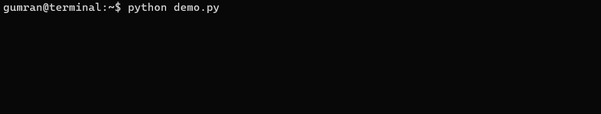

# Language Diffusion in <80 Lines of Code
A quick implementation of diffusion language models using `transformers`.



Much of this work is adapted from the paper [Large Language Diffusion Models](https://arxiv.org/pdf/2502.09992) by Nie et al. (2025). I've tried to keep the code clean and concise, so currently the training script has fewer than 80 lines of code.

## Setup
I recommend using `uv` to install packages (you can also just use `pip`):
```
pip install uv
uv pip install torch transformers datasets accelerate tqdm rich
```

## Run
- Run `accelerate launch train.py` to finetune [DistilBERT](https://huggingface.co/distilbert/distilbert-base-cased) on the [TinyStories](https://huggingface.co/datasets/roneneldan/TinyStories) dataset. 
  - Change the training arguments as required by your compute constraints.
  - I also uploaded the trained diffusion model to [Hugging Face](https://huggingface.co/gumran/distilbert-diffusion-TinyStories).
- Run `python demo.py` to use a trained model to generate short stories similar to those in the dataset.
- See below for details on how the scripts work.

## How it works
### Model
The model used is DistilBERT, which is pretrained for masked language modeling. It is an encoder-only transformer well-suited for our purposes. Otherwise, you can swap it for language model - even a "decoder-only" transformer like GPT - just make sure the attention mask is full of 1s instead of causal.

### Training
The training script is adapted from Algorthms 1 and 2 from the Nie et al. paper:
1. A sequence `x` is sampled from the training corpus;
2. A time step `t` is sampled uniformly between 0 and 1;
3. Each token in `x` is masked with probability `t`;
4. The model is trained to predict the masked tokens via maximum likelihood.

Importantly, the padding tokens can also be attended to, masked and modeled.

### Inference
The `demo.py` file is based on Algorithm 4:
1. We start with a fully masked sequence `x`;
2. For `t` going from 1 to 0 linearly in `T` steps:
    - Predict the masked tokens;
    - Remask each of the predicted tokens with probability `s/t`, where `s` is the next value of `t`.

We have a fully unmasked sequence at the end. 

Note that Nie et al. also describe a "lowest confidence" sampling process, but it is deterministic and unsuitable for unconditional generation. For more details, I recommend reading the paper and its references on language diffusion, such as [Simple and Effective Masked Diffusion Language Models](https://arxiv.org/abs/2406.07524) by Sahoo et al. (2024).

## Notes
- Diffusion language models strongly remind me of the novella ["Story of Your Life"](https://en.wikipedia.org/wiki/Story_of_Your_Life) by Ted Chiang, which the movie [_Arrival_](https://en.wikipedia.org/wiki/Arrival_(film)) is based on.
  - Of course, these models cannot tell the future, but they do process and communicate language non-sequentially. However, the language itself that they are trained to produce is sequential in nature, unlike in Chiang's story. Perhaps there is a way to train them on non-sequential representations of human language - if there are any good systems for that?
- For more comprehension, one might build the language model architecture from the ground up in PyTorch without `transformers`, but this was not the point of this project.
  - Still, I might do something like that in future. `extra/train_alternative.py` is supposed to handle single-GPU training without `accelerate`, but I haven't tested it yet. Dependencies can be further removed and this might grow into something resembling a package. 
- Increasing the size of the model and pretraining data and training on an instruction dataset via conditional maximum likelihood should achieve similar results to Nie et al. Interestingly, there should also be ways to align language diffusion models via RLHF since [it has been done](https://arxiv.org/abs/2302.08242) in the image domain.

## Contributing
I welcome any contributions to this repository. As mentioned above, I might want to relax the reliance on dependencies and/or think of instruction tuning and alignment.